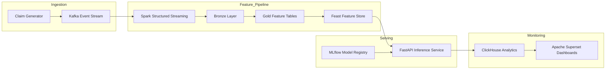

# Insurance Claims Real-Time ML Platform

Real-time insurance claims decisioning system demonstrating a **modern MLOps architecture** for streaming feature generation, model serving, and logs decisions for monitoring and analysis.

---

# Architecture Overview

## Architecture Overview



# Key Components

## Claim Simulator

Generates synthetic insurance claims and send them to Kafka.

Purpose:

- Simulate production traffic
- Stress test the pipeline
- Create realistic claim distributions

---

## Kafka

Event backbone of the platform.

Handles:

- Claim ingestion
- Streaming feature updates
- Event-driven ML scoring

---

## Spark Streaming

Processes raw claim events.

Responsibilities:

- Consume claim events from Kafka
- Create **bronze → gold feature tables**
- Generate aggregated features
- Update **feature store** in Feast

Examples:

- claims per member
- claim velocity
- claim amount statistics
- attachment pattern

---

## Feast Feature Store

Provides **online feature for real-time inference**.

Features are pulled during scoring such as:

- claim frequency
- provider risk
- policy activity
- recent claim behaviour

---

## MLflow Model Registry

Used for:

- model versioning
- experiment tracking
- model promotion

Example model URI used by inference:

```models:/claims-approval-model/Production```

---

## FastAPI Inference Service

Provides the real-time scoring endpoint.

### Endpoint

```POST/v1/claims:score```

### Example request

```json
{
  "claim_id": "c123",
  "member_id": "mem_42",
  "provider_id": "prov_12",
  "policy_id": "pol_91",
  "claim_amount": 1250.75,
  "channel": "api",
  "attachments_count": 2
}
```

### Example response

```json
{
  "claim_id": "c123",
  "decision": "DECLINE",
  "risk_score": 0.96,
  "model_uri": "models:/claims-approval-model/Production",
  "latency_ms": 4.8
}
```

## ClickHouse Analytics:

Stores inference and decision events for monitoring

### inference_logs table

Stores every model prediction

Used for:

- rejection rate monitoring
- score distribution analysis
- drift detection
- operational metrics

## Apache Superset

Provides dashboards on top of Clickhouse

Example dashboards:

- approval vs rejection rates
- risk score distribution
- latency metrics
- traffic volume
- model performance monitoring

---

# Running the System

## 1. Start infrastructure

```bash
docker compose up -d --build
```

This starts:

- Kafka
- Spark
- Feast
- MLflow
- ClickHouse
- Superset
- FastAPI inference API

## 2. Apply Feast feature store

```bash
docker compose run --rm feast-apply
```
## 3. Generate claim traffic

Start the load generator:

```bash
docker compose --profile load up -d inference-loadgen
```

## 4. Test scoring endpoint

Example request:

```bash
curl -X POST http://localhost:8000/v1/claims:score \
  -H "Content-Type: application/json" \
  -d '{
    "claim_id":"test-1",
    "member_id":"mem_1",
    "provider_id":"prov_1",
    "policy_id":"pol_1",
    "claim_amount":1000,
    "channel":"api",
    "attachments_count":0
  }'
```


